## Introducción
>
> Las estaciones meteorológicas basadas en Internet de las Cosas (IoT) representan una innovadora solución para el seguimiento climático. Estas estaciones utilizan una variedad de sensores diseñados para operar en exteriores y enfrentar diferentes condiciones climáticas. Estos sensores capturan datos en tiempo real sobre factores críticos como temperatura, luminosidad, humedad y la concentración de dióxido de carbono (CO2) en la atmósfera. Los datos recopilados se transmiten a través de Internet a una plataforma centralizada, accesible mediante interfaces web y aplicaciones móviles, permitiendo un análisis detallado de las condiciones climáticas y la identificación de patrones a lo largo del tiempo.

>Además de su función principal de monitoreo climático, estas estaciones meteorológicas IoT pueden integrarse con otros sistemas, como el riego inteligente, sistemas de climatización y pronósticos meteorológicos precisos. Esta capacidad tiene un impacto significativo en la toma de decisiones en campos que van desde la agricultura hasta la planificación urbana, mejorando la eficiencia y la sostenibilidad de las operaciones en estos sectores.

>Para garantizar el funcionamiento adecuado de la estación meteorológica, se requieren diversas funciones, como la medición de temperatura ambiente, la cantidad de luz en el ambiente, la medición de calidad del aire, la medición de proximidad y una conexión inalámbrica. Estos datos son recopilados por el sistema IoT y enviados a una plataforma centralizada a través de Internet, donde los usuarios pueden visualizarlos en tiempo real mediante una aplicación móvil. Esto permite a los usuarios monitorear y analizar las condiciones climáticas en tiempo real en una habitación, así como realizar un seguimiento de tendencias a lo largo del tiempo.

>El propósito fundamental de este sistema es gestionar un ambiente inteligente en una habitación, asegurando condiciones saludables para los ocupantes y permitiendo el control eficiente de los gastos energéticos mediante el análisis de la iluminación y la temperatura. Todo esto se logra de manera exclusiva a través de una aplicación móvil que permite administrar y supervisar estas funciones. El sistema IoT también incluye la capacidad de monitorear la calidad del aire en la habitación y ajustar la temperatura a través de un sistema de ventilación con al menos dos velocidades disponibles. En resumen, estas estaciones meteorológicas IoT son una solución completa para crear y gestionar un ambiente inteligente y saludable en una habitación.

## Resumen
>
> El sistema de Internet de las cosas (IoT) recopila información de sensores ubicados en una sala y la transmite a través de Internet a una plataforma centralizada. Estos datos se almacenan y son accesibles mediante una aplicación móvil, permitiendo a los usuarios supervisar las condiciones climáticas en tiempo real y analizar patrones a lo largo del tiempo. El objetivo principal del sistema es crear un entorno inteligente en la habitación para mantener condiciones óptimas de salud y gestionar eficientemente el consumo de energía. Todo esto se logra mediante una aplicación móvil que brinda a los usuarios la capacidad de controlar y ajustar el entorno según sus necesidades.

## Usos e implementación del análisis meteorológico

Claramente, el clima influye en múltiples aspectos de nuestra vida. Por ejemplo, en el sector del turismo, las condiciones climáticas pueden impactar en la selección de destinos y en las actividades que podemos disfrutar durante nuestras vacaciones. Un clima cálido y soleado suele hacer que los destinos costeros sean más atractivos, mientras que las estaciones de esquí son preferidas en tiempos fríos y nevados.

- En el ámbito de la moda, las condiciones del tiempo también tienen un papel destacado. Nuestra elección de ropa cotidiana, como abrigos en invierno o trajes de baño en verano, está directamente influenciada por el clima predominante en nuestra ubicación.


- El clima también tiene un impacto significativo en la movilidad y el transporte. Condiciones climáticas adversas, como tormentas de nieve o fuertes lluvias, pueden complicar los desplazamientos y alargar los tiempos de viaje, lo que puede tener efectos en la planificación de actividades diarias y en la logística empresarial, incluyendo el transporte de mercancías.

- Seguimiento de la trayectoria del vehículo en casos de robo, localización en tiempo real a través de GPS de la flota, mejora de las rutas al enviar al cliente el vehículo más cercano para ahorrar tiempo y combustible, supervisión simultánea de la mercancía y el vehículo mediante el mismo sistema, proporcionando información tanto a la empresa como al cliente. Incremento de la seguridad del conductor al eliminar la necesidad de comunicarse constantemente con la base para reportar su ubicación.

- En el área de la agricultura, la utilización de recursos naturales y el aprovechamiento de este, permitiendo el ahorro de recursos en las siembras realizadas en esta área.

- Incluso nuestra salud y bienestar se ven relacionados con el clima. Las altas temperaturas pueden aumentar el riesgo de golpes de calor, mientras que la falta de luz solar en invierno puede afectar nuestro estado de ánimo y contribuir a la aparición de la depresión estacional.

## Beneficios del análisis meteorológico

> Protección de Bienes y Seguridad Personal:

Una estación meteorológica tiene la capacidad de emitir alertas ante cambios súbitos en las condiciones climáticas, como tormentas eléctricas, vientos fuertes o precipitaciones intensas. Estas notificaciones tempranas pueden contribuir a la salvaguarda de propiedades y a garantizar la seguridad personal. Por ejemplo, si se anticipa una tormenta con vientos poderosos, se pueden tomar medidas preventivas para resguardar edificaciones y objetos al aire libre.

> Mejora en la Exactitud de las Predicciones:

Contar con una estación meteorológica proporciona datos en tiempo real sobre una variedad de factores climáticos, como la temperatura, la humedad, la velocidad y orientación del viento, las precipitaciones y la presión atmosférica, entre otros. Estos datos permiten generar pronósticos más precisos, especialmente en áreas donde las previsiones estándar podrían no ser lo suficientemente fiables debido a las particularidades geográficas locales.

> Apoyo a la Investigación y Estudios Climáticos:

Las estaciones meteorológicas desempeñan una función esencial en la investigación y los análisis climáticos a largo plazo. Los datos recolectados de manera constante y precisa brindan información valiosa para comprender los patrones climáticos, el cambio climático y el impacto humano en el entorno ambiental. Esta contribución es de suma relevancia para científicos, académicos y entidades gubernamentales involucrados en la toma de decisiones vinculadas al clima.

> Beneficios:
- Exactitud en sus mediciones.
- Son dispositivos que se pueden transportar con facilidad.
- Se destacan por su sencillez de manejo y legibilidad.
- Operan con baterías o aprovechando la energía solar, lo que elimina la necesidad de una conexión a la red eléctrica.

## Impacto ambiental

La meteorología implica el análisis de las condiciones atmosféricas en una región específica, requiriendo la recopilación de diversos datos meteorológicos como temperatura, presión atmosférica, humedad, velocidad del viento y radiación solar. Estos datos son esenciales para crear pronósticos y evaluar su impacto en actividades regionales.
Para obtener estos datos en tiempo real, se han desarrollado las Estaciones Meteorológicas, dispositivos físicos con sensores estratégicamente ubicados que pueden adaptarse a distintas aplicaciones, desde agricultura hasta aviación. Actualmente, estas estaciones cuentan con sistemas automatizados de alta tecnología que minimizan la intervención humana y permiten el intercambio global de datos entre estaciones, mejorando la precisión de pronósticos y estudios climáticos.

- La producción y el mantenimiento de las estaciones meteorológicas pueden tener impactos negativos en el medio ambiente, como la generación de residuos y sustancias químicas dañinas, enfatizando la importancia de una gestión ambiental adecuada.

- El empleo de diversas fuentes de energía en las estaciones meteorológicas, como la electricidad convencional o la energía solar, tiene un impacto ambiental.

- La elección de energías renovables, como la solar, puede reducir la dependencia de la red eléctrica y disminuir las emisiones de carbono asociadas, lo que beneficia al medio ambiente.

- La instalación de una estación en áreas ecológicamente sensibles, como parques naturales o zonas de vida silvestre, podría tener repercusiones negativas en la biodiversidad local.

- La eficiente administración de los datos recolectados por estas estaciones resulta esencial. Si no se manejan de manera efectiva, existe el riesgo de desaprovechar estos datos, lo que implica que los recursos invertidos en su recopilación podrían no utilizarse eficazmente.

- Las estaciones meteorológicas son vitales para la agricultura al ofrecer datos clave sobre el clima. Esto capacita a los agricultores para decisiones informadas, promoviendo la eficiencia en el uso de recursos y reduciendo el uso de pesticidas.


## ¿Qué es MQTT?
>
> MQTT (Message Queuing Telemetry Transport) es un protocolo de mensajería que se utiliza para facilitar la comunicación entre dispositivos en una red. Es especialmente útil para escenarios donde se requiere un uso eficiente del ancho de banda y una baja latencia. MQTT es ampliamente utilizado en aplicaciones de Internet de las Cosas (IoT) debido a su diseño ligero y eficiente.

## Componentes clave de MQTT

> Broker:

- Función: El broker es el servidor central en una red MQTT. Su tarea principal es recibir todos los mensajes publicados por los publicadores y luego distribuirlos a los suscriptores relevantes.

>Tipos de Broker:

- Gratuitos: Hay varios brokers MQTT gratuitos disponibles para uso personal o de desarrollo, como Mosquitto, HiveMQ Community Edition, y EMQ X Broker.

- De Paga: Para aplicaciones empresariales o de alta disponibilidad, existen soluciones de pago como HiveMQ, IBM MessageSight, y Azure IoT Hub que ofrecen características adicionales como escalabilidad, seguridad mejorada y soporte técnico.

> Publisher (Publicador):

- Función: Un publicador es cualquier dispositivo que envía mensajes al broker. Estos mensajes se organizan en "temas" para facilitar la administración y distribución.

- Ejemplo: En el caso descrito, un Arduino actúa como un publicador enviando datos del sensor de temperatura al broker bajo el tema "habitación/temperatura".

> Subscriber (Suscriptor):

- Función: Un suscriptor es cualquier dispositivo que recibe mensajes de un broker. Los suscriptores se "suscriben" a uno o más temas y reciben actualizaciones cada vez que un publicador envía un mensaje relacionado con esos temas.

- Ejemplo: En el escenario dado, un servidor Node.js actúa como un suscriptor, recibiendo datos del sensor de temperatura cada vez que el Arduino publica un nuevo mensaje en el tema "habitación/temperatura".

## Flujo de Trabajo en MQTT

- Publicación de Datos: Los dispositivos publicadores envían mensajes a temas específicos en el broker.

- Broker MQTT: Recibe los mensajes y los almacena temporalmente en una cola si es necesario.

- Suscripción a Datos: Los suscriptores reciben mensajes del broker basados en los temas a los que están suscritos.

- Envío a la Base de Datos: En aplicaciones más complejas, los datos recibidos pueden ser procesados y almacenados en una base de datos para su posterior análisis o recuperación.

- Interacción del Usuario: Las aplicaciones de usuario final, como aplicaciones móviles o web, pueden actuar como suscriptores para recibir datos en tiempo real o recuperarlos de una base de datos según sea necesario.

En resumen, MQTT es un protocolo de mensajería eficiente y flexible que facilita la comunicación en tiempo real entre dispositivos en redes de baja potencia o de baja calidad. Su arquitectura de broker y su modelo de publicación/suscripción lo hacen ideal para aplicaciones de IoT y otros escenarios donde la eficiencia y la rapidez son cruciales.

## Implementacion de Arduino

- Arduino es la elección ideal para un proyecto de estación meteorológica con sensores de humedad, proximidad, luminosidad, ventilador y módulo MQTT debido a su flexibilidad y capacidad de integración. La plataforma Arduino permite la conexión y programación sencilla de una amplia gama de sensores, lo que facilita la recopilación de datos precisos sobre el clima. Además, la capacidad de controlar un ventilador o realizar acciones basadas en datos meteorológicos en tiempo real se logra de manera eficiente con Arduino. El módulo MQTT permite la comunicación y transmisión de datos de manera efectiva, lo que facilita la visualización y el análisis de la información meteorológica en línea. En resumen, Arduino ofrece una solución completa y versátil para un proyecto de estación meteorológica con múltiples sensores y funcionalidades.

> Inicialización y Declaración de Variables en Arduino: aqui encontaremos nuestas variables y la inicializacion de las mismas

``` ino
#include <doxygen.h>
#include <ESP8266.h>

#include "ESP8266.h"
#include <SoftwareSerial.h>
#include "DHT.h"
#include <Servo.h>

const int ledPin = 13;      // Pin del LED
const int buttonPin = 2;    // Pin del botón
volatile bool ledState = LOW;   // Estado actual del LED

unsigned long lastBlinkTime = 0;   // La última vez que el LED parpadeó
const long blinkInterval = 1000;   // Intervalo de parpadeo en milisegundos


Servo myServo;
int PosInicial = 0;
int PosActual = 0;
bool puertaAbierta = false;

const char * SSID = "TIGO-M";
const char * PASSW = "WnJiE723fWz*2VzJ";
const char * HOST_NAME = "192.168.1.16";
const int HOST_PORT = 3000;

bool ventiladorEncendido = false;
bool velocidadAlta = false;

ESP8266 wifi(Serial1);

#define MQ135pin A0
  
#define led 6

// Definimos el pin digital donde se conecta el sensor
#define DHTPIN 4
// Dependiendo del tipo de sensor
#define DHTTYPE DHT11
#define echoPin 2
#define pingPin 3
#define motorPin 5  // Pin digital para controlar el motor
#define sensorPin A1  // Pin analógico del sensor KY-018 conectado a A1 de Arduino

// Variables para la calibración. Ajusta estos valores según tu calibración.
const int valorMinimo = 0;    // Valor mínimo leído por el sensor en completa oscuridad
const int valorMaximo = 1023; // Valor máximo leído por el sensor en una fuente de luz conocida
int estado_led = 0;
float h;
float t;

float temperatura; 
float lumen; 
float co2;
float distancia;

// Inicializamos el sensor DHT11
DHT dht(DHTPIN, DHTTYPE);
float sensorValue; // variable para guardar el valor analógico del sensor
float lecturaSensor;

int velocidadAltaIntervalo = 1850;  // Intervalo para alta velocidad en milisegundos
int velocidadBajaIntervalo = 5500;//3475; // Intervalo para baja velocidad en milisegundos
```

> Funcion Setup(): dentro de esta funcion tenemos la parte de la cominicación serial con nuestro arduino

```ino
void setup() {
  // put your setup code here, to run once:
  Serial.begin(115200);
  Serial1.begin(115200);
  dht.begin();
  pinMode(led, OUTPUT);
  pinMode(sensorPin,INPUT);
  pinMode(pingPin, OUTPUT); // initialising pin 3 as output
  pinMode(echoPin, INPUT); // initialising pin 2 as input
  pinMode(motorPin,OUTPUT);

  Serial.println("Wi-Fi init...");
  if (wifi.joinAP(SSID, PASSW)) {
    Serial.print("Join AP success\r\n");
    Serial.print("IP:");
    Serial.println(wifi.getLocalIP().c_str());

  } else {
    Serial.print("Join AP failure\r\n");

    }

  if (wifi.disableMUX()) {
    Serial.print("single ok\r\n");
  } else {
    Serial.print("single err\r\n");
  }
  Serial.print("setup end\r\n");
  myServo.attach(9);
  myServo.write(PosInicial);
  Serial.begin(9600);
  Serial.println("ESTAMOS PROBANDO MOTOR");

  pinMode(ledPin, OUTPUT);
  pinMode(buttonPin, INPUT_PULLUP);

  // Configurar la interrupción para el botón
  attachInterrupt(digitalPinToInterrupt(buttonPin), toggleLED, FALLING);

  // Iniciar el WDT con un intervalo de 4 segundos
  wdt_enable(WDTO_4S);

  pinMode(ledPin, OUTPUT);
  pinMode(buttonPin, INPUT_PULLUP);

  // Configurar la interrupción para el botón
  attachInterrupt(digitalPinToInterrupt(buttonPin), toggleLED, FALLING);

  // Iniciar el WDT con un intervalo de 4 segundos
  wdt_enable(WDTO_4S);
  
  // Verificar la memoria al inicio
  if (getFreeMemory() < 50) { // Si hay menos de 50 bytes de RAM libre
    errorHandler();
  }
  
}
```

> Funcion Loop(): aqui invocamos a nuestras funciones hacer request y manejo de velocidad

```ino
void loop() {
  manejarVelocidad();
  hacerRequest();
}
```

> Hacer Petición: en esta se hacen las peticiones necesarias para poder obtener la información

```ino
int request_step = 2000;
static unsigned long request_last_time = 0;
void hacerRequest() {
  unsigned long now = millis();
  if (now - request_last_time < request_step) return;
  request_last_time = now;


  temperatura = leerTemperatura();
  Serial.print("Temperatura: ");
  Serial.print(temperatura);
  Serial.println(" *C ");  
  lumen = leerLumen();
  co2 = leerCO2();
  distancia = leerDistancia();
  if (!MedicionesValidas(temperatura, lumen, co2, distancia)){
    Serial.println("Temperatura NaN");  
    return;
  }

  if (wifi.createTCP(HOST_NAME, HOST_PORT)) {
    //Serial.print("syncPomodoroSettings tcp ok.       ");
  } else {
    Serial.print("syncPomodoroSettings tcp failed\r\n");
    return 1;
  }

  String body = "{";
    
  body += "\n\"T\":";
  body += temperatura;
  body += ",\n\"C\":";
  body += co2;
  body += ",\n\"L\":";
  body += lumen;
  body += ",\n\"D\":";
  body += distancia;

  body += "}";

  String request = "POST /update_state HTTP/1.1\r\n";
  request += "Host: ";
  request += HOST_NAME;
  request += "\r\nAccept: application/json";
  request += "\r\nContent-Type: application/json";
  request += "\r\nContent-Length: ";
  request += body.length();
  request += "\r\n\r\n";
  request += body;
  //Serial.println(request);
  uint8_t buffer[800] = {0};
  wifi.send((const uint8_t * ) request.c_str(), request.length());
  uint32_t len = wifi.recv(buffer, sizeof(buffer), 10000);


  if (len <= 0) {
    return 2;
  }
  String msg = "";
  for (uint32_t i = 0; i < len; i++) {
    char c = (char) buffer[i];
     Serial.print(c);
    if (c == '~') {
      for (uint32_t j = i + 1; j < len; j++) {
        c = (char) buffer[j];
        if (c == '~') break;
        msg = msg + c;
      }
      break;
    }
  }

  Serial.println(msg);
    // Serial.print("\r\n");

  //Now, parse its values
  String strs[2];
  int StringCount = 0;
  while (msg.length() > 0) {
    int index = msg.indexOf(',');
    if (index == -1) // No space found
    {
      strs[StringCount++] = msg;
      break;
    }
    else
    {
      strs[StringCount++] = msg.substring(0, index);
      msg = msg.substring(index+1);
    }
  }
  //Do parsed
  if(strs[0] == "0"){
      apagarLuz();
  }else if(strs[0] == "1"){
    encenderLuz();
  }
  
  if(strs[1] == "0"){
    apagarVentilador();
    ventiladorEncendido = false;
    return;
  }
  
  if(strs[1] == "1"){
    velocidadAlta = false;
  }else{
    velocidadAlta = true;
  }
  ventiladorEncendido = true;
}
```

> Lectura de Luminosidad, Aire, Temperatura y Distancia: se lee la información proporcionada por los sensores

```ino
loat leerTemperatura()
{
  // Leemos la temperatura en grados centígrados (por defecto)
  t = dht.readTemperature();
  return t;
}

float leerLumen()
{
  lecturaSensor = analogRead(sensorPin); // Leer el valor analógico del sensor
  float voltage = lecturaSensor * (5.0/1025) * 1000;
  float resistencia = 10000 * (voltage / (5000.0 - voltage));
  // Realizar la conversión utilizando una regla de tres simple para ajustar el rango leído al rango de lux
  float lux = (500.0 / resistencia) * 1000;
  return lux;  
}

float leerDistancia(){
  long duration, cm;
  
  digitalWrite(pingPin, LOW);
  delayMicroseconds(2);
  
  digitalWrite(pingPin, HIGH);
  delayMicroseconds(10);
  
  digitalWrite(pingPin, LOW);
  
  duration = pulseIn(echoPin, HIGH); // using pulsin function to determine total time
  cm = microsecondsToCentimeters(duration); // calling method
  
  delay(250);
  return cm;  
}

float leerCO2()
{
  sensorValue = analogRead(MQ135pin); // Lectura digital del sensor de CO2
  return sensorValue;
}

long microsecondsToCentimeters(long microseconds) // method to covert microsec to centimeters
{
   return microseconds / 29 / 2;
}
```

> Maneo de Velocidad de Motor: aqui se encuentra el codigo para el manejo de las velocidades del motor

```ino
int manejarVelocidad_step = 1000;
static unsigned long manejarVelocidad_last_time = 0;
int current_count = 0;
bool current_is_on = false;

void manejarVelocidad() {
  unsigned long now = millis();
  int dstep;

  if (!current_is_on) {
    dstep = manejarVelocidad_step * 1;
  }
  else {
    if (velocidadAlta) {
      dstep = manejarVelocidad_step * 4;
    }
    else {
      dstep = manejarVelocidad_step * 2;
    }
  }
  
  if (now - manejarVelocidad_last_time < manejarVelocidad_step) return;
  manejarVelocidad_last_time = now;

  if (!ventiladorEncendido) return;


  if (!current_is_on) {
    Serial.println("Vent OFF");
    digitalWrite(motorPin, LOW); //original: HIGH
    current_is_on = true;
    return;
  }

  digitalWrite(motorPin, HIGH); //original: LOW
  Serial.println("Vent ON");
  current_is_on = false;
  return;
}
```

> Manejo de Ventilador: aqui se encuentra el codigo para el manejo de velocidades y encendido del ventilador y las luces indicadoras

```ino
void apagarVentilador(){
  Serial.println("Vent ON");
  digitalWrite(motorPin, HIGH); //invertir? original: LOW
}

void encenderLuz(){
  digitalWrite(led, HIGH);
}

void apagarLuz(){
  digitalWrite(led, LOW);
  estado_led = 0;
}
```

> Metodo Validador de Mediciones: se validan que no hayan valores erroneos

```ino
bool MedicionesValidas(float temperatura, float lumen, float co2, float dist)
{
  // Verificar si alguna medición es NaN
  if (isnan(temperatura) || isnan(lumen) || isnan(co2) || isnan(dist))
  {
    return false;
  }
  return true;
}
```

> Metodo de ServoMotor: este es el que detecta la cercania y activa el motor para la apertura y cierre de la puerta:

```ino
void Servo() {
  if (!puertaAbierta) {
    // Abrir la puerta (girar 90 grados hacia adelante)
    for (int i = 0; i <= 90; i++) {
      myServo.write(i);
      delay(20);
    }
    puertaAbierta = true;
  } else {
    // Cerrar la puerta (girar 90 grados hacia atrás)
    for (int i = 90; i >= 0; i--) {
      myServo.write(i);
      delay(20);
    }
    puertaAbierta = false;
  }}
  delay(5000); // Esperar 5 segundos antes de repetir el proceso
}
```

## Implementación Base de Datos

- Utilizar una base de datos SQL en un proyecto de estación meteorológica con Arduino proporciona una estructura organizada y eficiente para almacenar y gestionar los datos recopilados. Esto facilita el acceso, la consulta y el análisis de registros meteorológicos a lo largo del tiempo, lo que permite realizar un seguimiento preciso de las condiciones climáticas, identificar patrones y tendencias, y respaldar decisiones informadas en diversas aplicaciones, como pronósticos, investigaciones científicas o aplicaciones agrícolas. Además, el uso de una base de datos SQL garantiza la integridad y la consistencia de los datos, así como la posibilidad de compartirlos y visualizarlos de manera efectiva a través de diversas interfaces y herramientas de análisis.

> Creacion de Base de Datos:

``` sql
CREATE DATABASE `weather_db` /*!40100 DEFAULT CHARACTER SET utf8mb4 COLLATE utf8mb4_0900_ai_ci */ /*!80016 DEFAULT ENCRYPTION='N' */;
```

> Creación de Tabla para datos del Aire:

``` sql
-- weather_db.proximidad definition
CREATE TABLE `proximidad` (
  `Value` decimal(10,2) NOT NULL DEFAULT '0',
  `Date` date NOT NULL,
  `Time` time NOT NULL
) ENGINE=InnoDB DEFAULT CHARSET=utf8mb4 COLLATE=utf8mb4_0900_ai_ci;
```

> Creación de Tabla para datos de Humedad:

``` sql
-- weather_db.humedad definition

CREATE TABLE `humedad` (
  `Value` decimal(10,2) NOT NULL DEFAULT '0',
  `Date` date NOT NULL,
  `Time` time NOT NULL
) ENGINE=InnoDB DEFAULT CHARSET=utf8mb4 COLLATE=utf8mb4_0900_ai_ci;
```

> Creación de Tabla para datos de Luminosidad:

``` sql
-- weather_db.lumen definition

CREATE TABLE `lumen` (
  `Value` decimal(10,2) NOT NULL DEFAULT '0',
  `Date` date NOT NULL,
  `Time` time NOT NULL
) ENGINE=InnoDB DEFAULT CHARSET=utf8mb4 COLLATE=utf8mb4_0900_ai_ci;
```

> Creación de Tabla para datos de Temperatura:

``` sql
-- weather_db.temperatura definition

CREATE TABLE `temperatura` (
  `Value` decimal(10,2) NOT NULL DEFAULT '0',
  `Date` date NOT NULL,
  `Time` time NOT NULL
) ENGINE=InnoDB DEFAULT CHARSET=utf8mb4 COLLATE=utf8mb4_0900_ai_ci;
```

> Creación de Tabla para datos de Proximidad:

``` sql
-- weather_db.proximidad definition
CREATE TABLE `proximidad` (
  `Value` decimal(10,2) NOT NULL DEFAULT '0',
  `Date` date NOT NULL,
  `Time` time NOT NULL
) ENGINE=InnoDB DEFAULT CHARSET=utf8mb4 COLLATE=utf8mb4_0900_ai_ci;
```

> Consulta de Historial de Humedad:

``` sql
create procedure historic_humd (
IN ini_date date,
IN end_date date
)
begin

 SELECT Value, `Date`, `Time` FROM weather_db.humedad h 
 where Date >= ini_date and Date <= end_date
 order by Date asc;
end
```

> Consulta de Historial de Luminosidad:

``` sql
create procedure historic_lumen (
IN ini_date date,
IN end_date date
)
begin

 SELECT Value, `Date`, `Time` FROM weather_db.lumen l
 where Date >= ini_date and Date <= end_date
 order by Date asc;
end
```

> Consulta de Historial de Temperatura:

``` sql
create procedure historic_temp (
IN ini_date date,
IN end_date date
)
begin

 SELECT Value, `Date`, `Time` FROM weather_db.temperatura
 where Date >= ini_date and Date <= end_date
 order by Date asc;
end
```

> Consulta de Historial de Aire:

``` sql
create procedure historic_air (
IN ini_date date,
IN end_date date
)
begin

 SELECT Value, `Date`, `Time` FROM weather_db.air
 where Date >= ini_date and Date <= end_date
 order by Date asc;
end
```


## Imagenes del boceto del prototipo
>
> 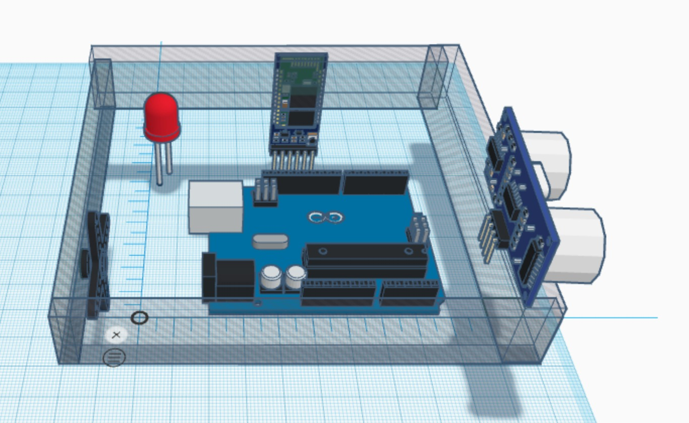
> Imagen realizada en TinkerCad.

## Imagenes de la construcción del prototipo
>
> 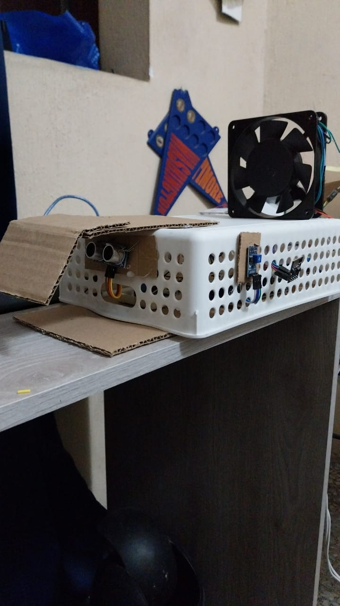
> 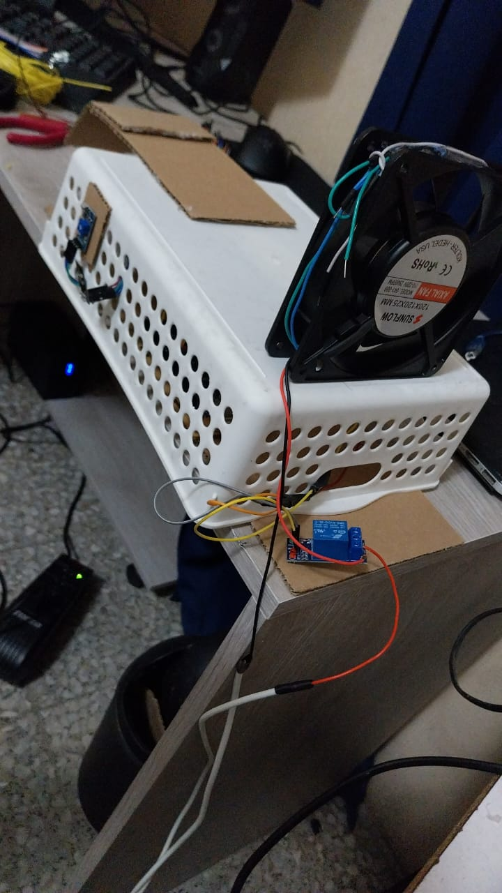
> 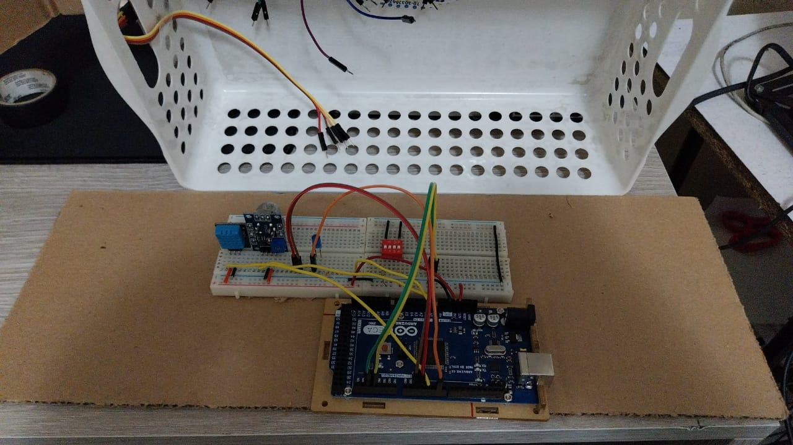

## Imagenes de la aplicación
>
> 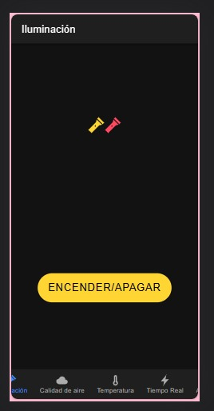
> 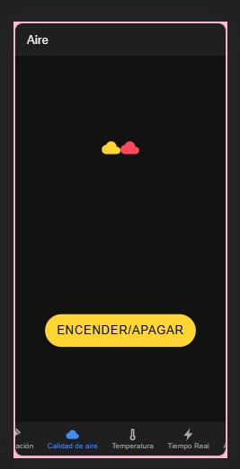
> 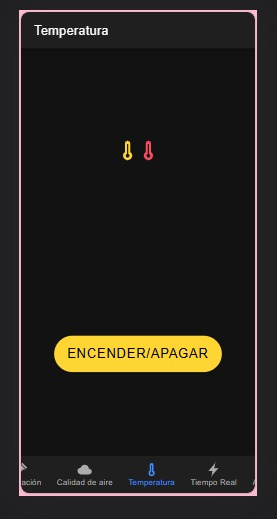
> 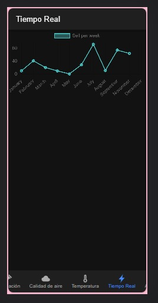

### Capas del framework utilizado IOT utilizadas
>
> Capa de percepción
En relación a nuestra estrategia de percepción, hemos dirigido nuestra atención hacia la identificación de los datos esenciales requeridos para efectuar mediciones precisas. En consecuencia, se tomó la decisión de adquirir los dispositivos enlistados a continuación, con el propósito de garantizar una captura precisa de la información necesaria.

- Sensores:
  - Detector de calidad de aire MQ135
  - Sensor de humedad y temperatura DHT11
  - Foto-resistor (para medir la intensidad de luz) KY-018
  - Sensor super Zonico
  - Modulo Wifi ARD-390
  - Diodo Led


- Microcontroladores:
  - Arduino Mega

- Cables
  - Tipo Dupont
- Dispositivos
  - Laptop
  - Celular

> 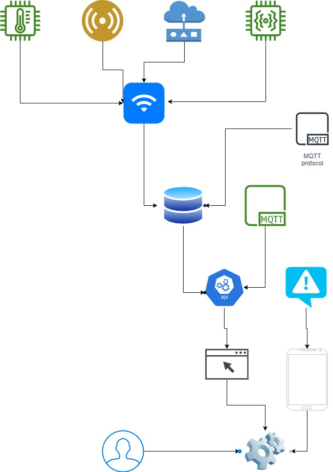

> Capa de Conexión

> 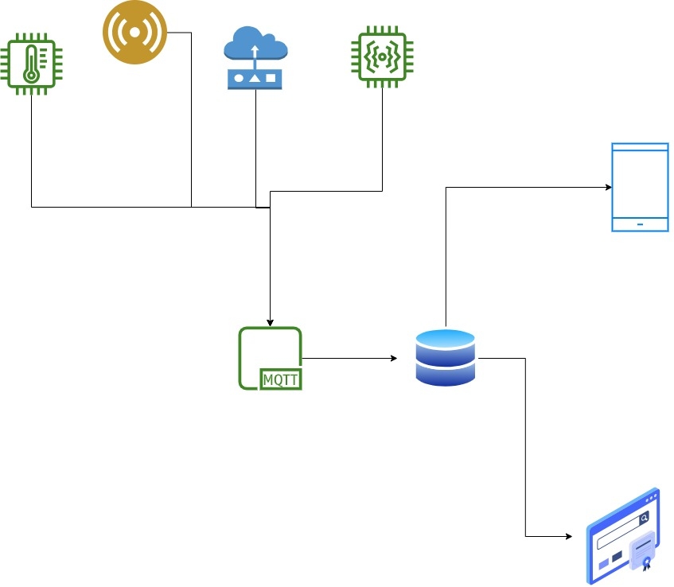

Dentro de nuestra estructura de conexiones, hemos incorporado diversas formas de enlace que se ajustan de manera coherente a los principios y necesidades fundamentales de nuestro proyecto. La forma en que establecemos la conexión se describe a continuación:

- Conexión WiFi a través de una red inalámbrica: Empleamos este método de conexión para habilitar la transferencia bidireccional de datos entre nuestro dispositivo y la red WiFi. Los datos que se transmiten y reciben a través de esta red son fundamentales para el proceso en el cual analizamos y gestionamos la información de manera eficiente.

- Cola de Mensajes (MQTT): El sistema utiliza MQTT para enviar datos de los sensores a una plataforma centralizada.


> Capa de Procesamiento y Almacenamiento

Dentro de la fase de procesamiento adoptada, se emplea la recopilación de información a través de la conexión WiFi como paso fundamental para organizar y almacenar datos en la base de datos. Esta elección contribuye a presentar de forma clara y concisa la información proveniente del dispositivo en cuestión.

La explicación de esta etapa radica en cómo los datos, originados en el dispositivo Arduino, son transmitidos a través de una conexión WiFi, siguiendo un proceso de comunicación similar a una conversación. Posteriormente, estos datos son capturados por un programa desarrollado en Node.js, que funge como el núcleo de toda la estructura implementada. Este programa se encarga de recopilar los datos cada 2 segundos y actualizarlos directamente en una base de datos específica. Este enfoque garantiza que, en el momento de crear informes, estos puedan generarse de manera clara y fácil de comprender, de acuerdo con las necesidades del proyecto.

- Base de Datos: Los datos recopilados de los sensores son almacenados en una base de datos, ya sea local o en la nube.

- Sistema de Cola de Mensajes: Los datos se envían a una plataforma centralizada a través de MQTT.

> 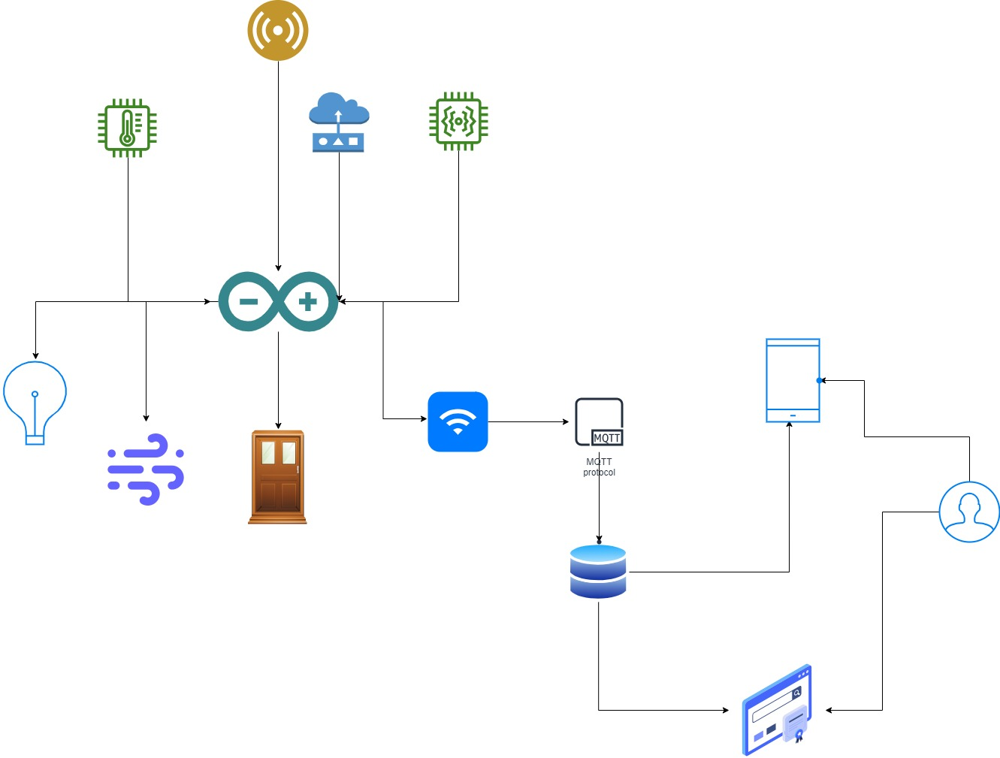

> Capa de abstracción de datos

El proceso de comunicación en nuestro sistema se lleva a cabo de manera eficiente y coordinada entre diferentes componentes. En el caso de Arduino, este envía los datos recopilados por los sensores, mientras que nuestra API responde proporcionando el estado actual del ventilador y la luz, permitiendo un control integral del ambiente.

En el contexto de Python, el flujo de información es análogo; Python recibe datos sobre el estado general de la aplicación y, a su vez, proporciona datos que deben ser almacenados y otros que deben ser transmitidos al Arduino, facilitando así la gestión completa del sistema.

En el caso de la interacción con el teléfono, el proceso se diferencia en que es iniciado por el usuario. El usuario envía comandos o solicitudes a la aplicación, que luego se encarga de procesarlos y enviar los datos en tiempo real, permitiendo al usuario mantener un control total sobre el sistema desde su dispositivo móvil. Esta sincronización y flujo de información entre todos los componentes aseguran un funcionamiento óptimo y una experiencia de usuario satisfactoria.

- API: Responsable de procesar y transmitir datos entre la base de datos y las aplicaciones web y móvil.

- Notificaciones: Basado en ciertos criterios, el sistema puede enviar notificaciones a las aplicaciones sobre condiciones específicas (por ejemplo, calidad del aire deficiente).

> Capa de Aplicación

- Aplicación Web: Permite visualizar gráficos y métricas relacionadas con la temperatura, presencia humana, iluminación y calidad del aire. Implementa el software Grafana.

- Aplicación Móvil: Proporciona una interfaz para controlar el sistema de seguridad (puerta) y el sistema de ventilación (ventilador). Además, permite monitorear la temperatura de la habitación.

> Capa de Usuario Final:

- Usuario en la Habitación: Puede beneficiarse de un ambiente controlado basado en las lecturas de los sensores y las acciones de los actuadores.

- Interfaz de Software: Las aplicaciones en el teléfono celular y en la web actúan como interfaces entre el usuario y el sistema, permitiéndole monitorear y controlar diversas funciones.

> 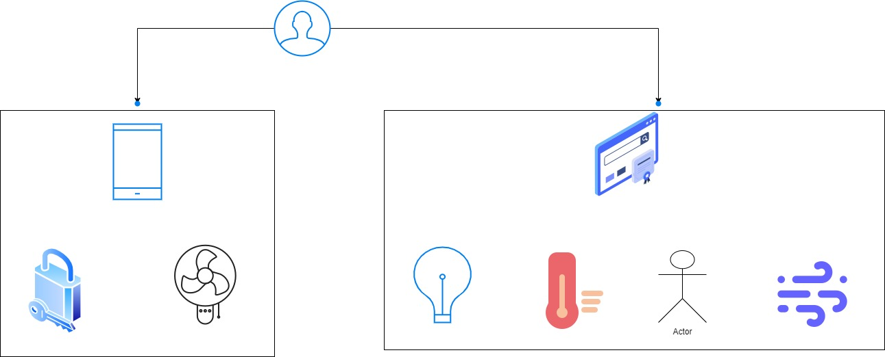

> 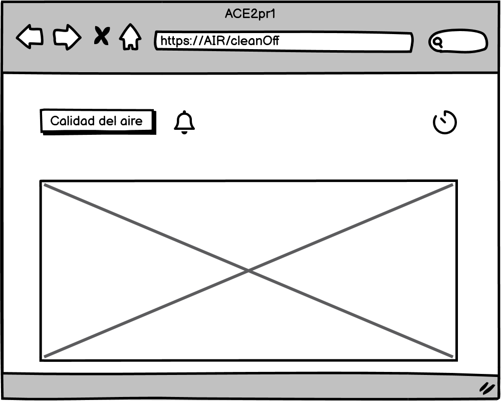

> 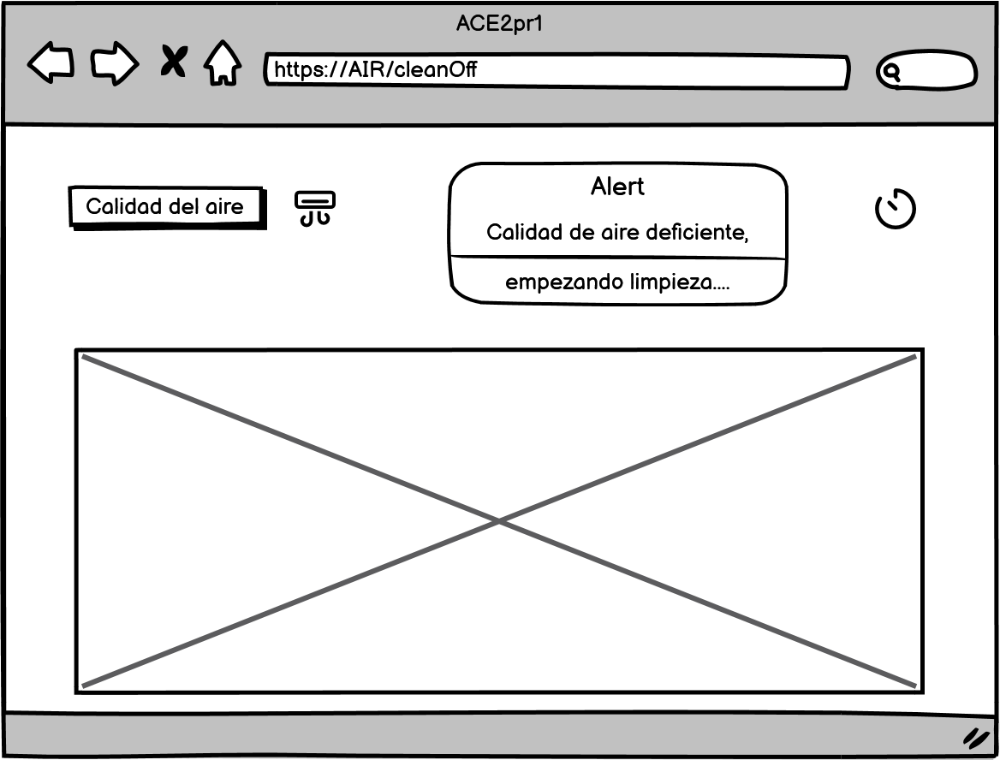

> 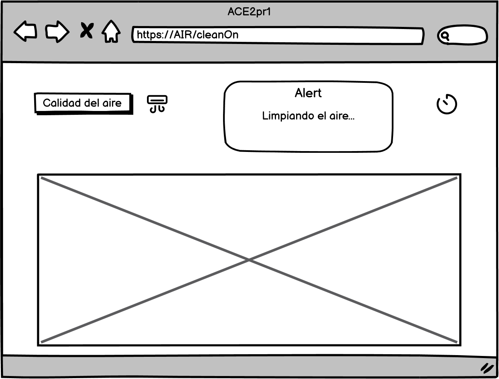

> 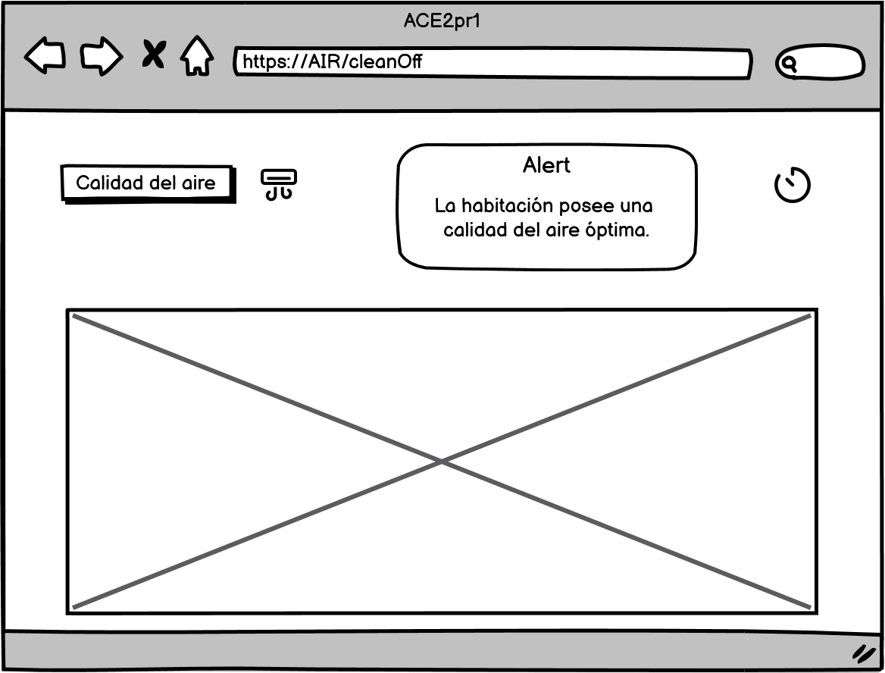

> 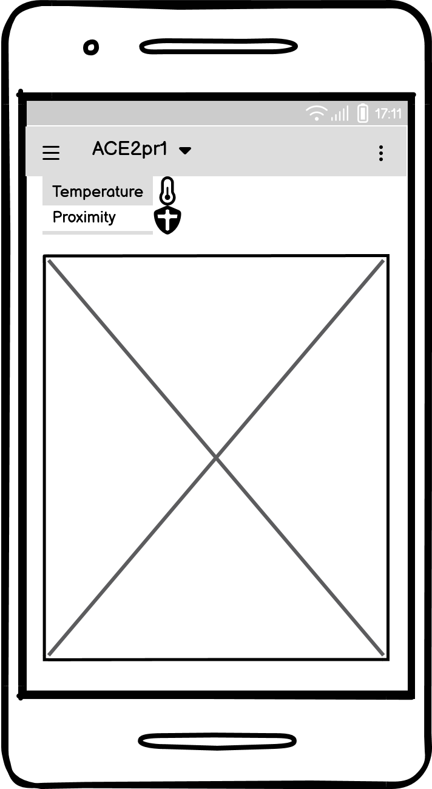

> 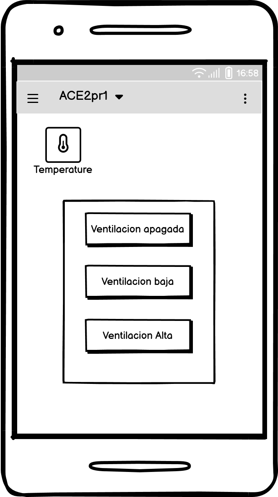

> 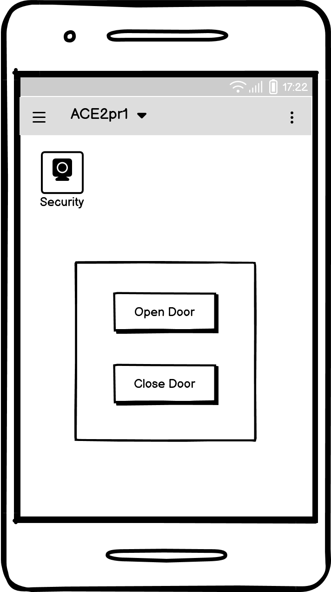

> 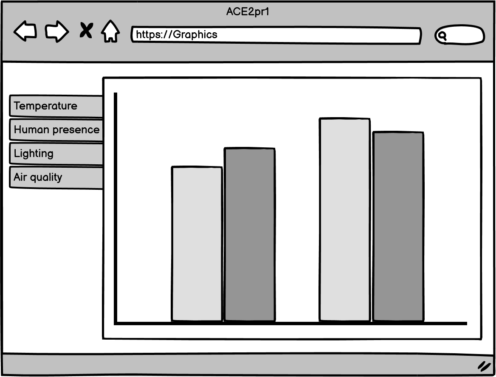

> 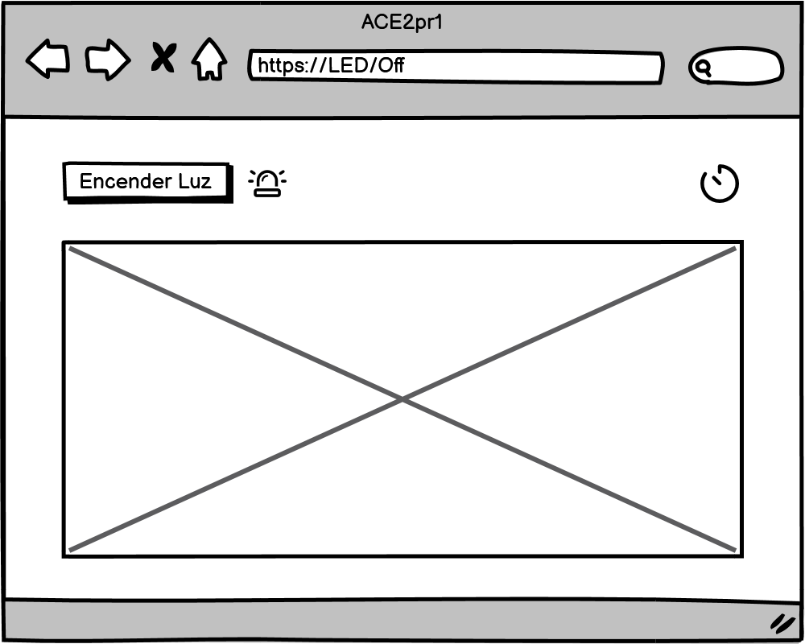

> 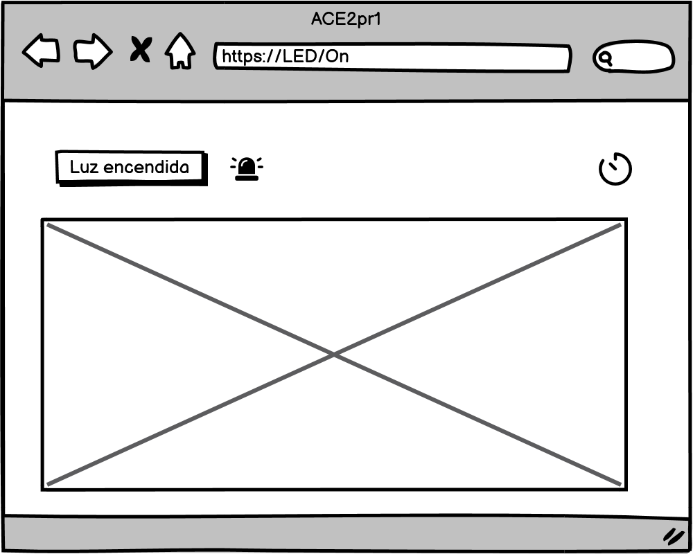

> 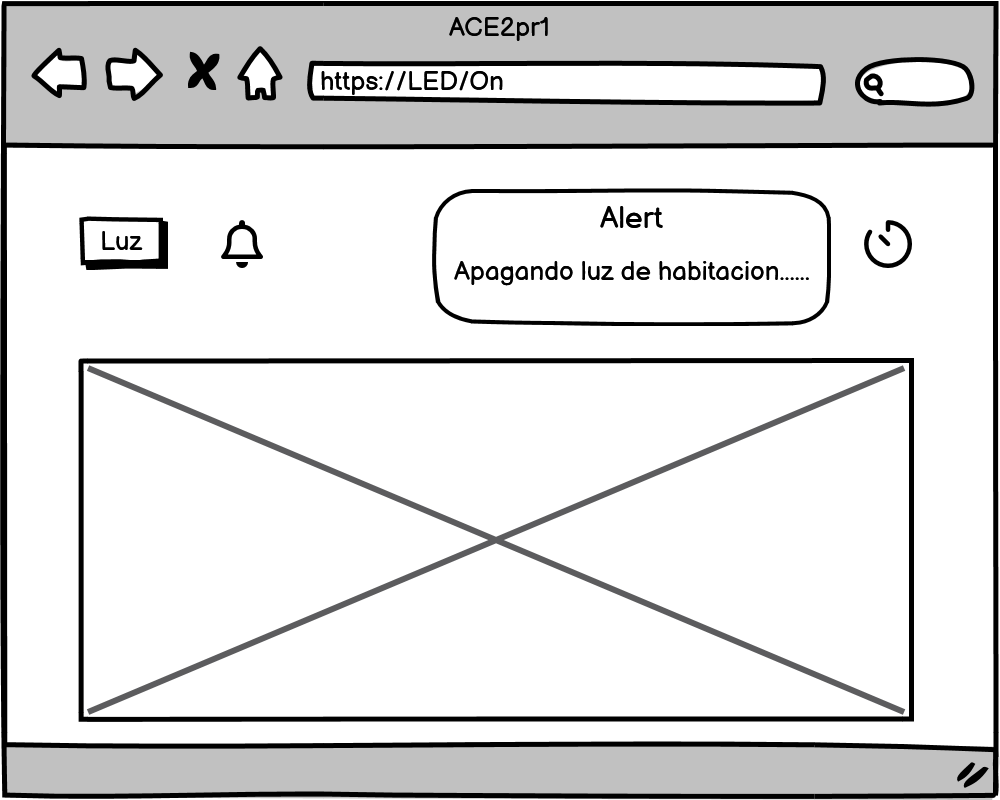

## Integrantes


- [Walther Andree Corado Paiz – 201313861](http://linkedin.com/ProfileURL)
- [Erick Noe Gómez López – 201700866](http://linkedin.com/ProfileURL)
- [Carlos Javier Martínez Polanco - 201709282](http://linkedin.com/ProfileURL)
- [Sharon Estefany Tagual Godoy - 201906173](http://linkedin.com/ProfileURL)
- [Carlos Eduardo Soto Marroquín - 201902502](http://linkedin.com/ProfileURL)
- [Xhunik Nikol Miguel Mutzutz - 201900462](http://linkedin.com/ProfileURL)

